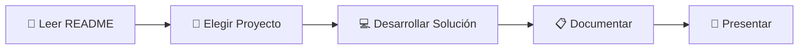

# 🎯 Reto Final - IA para Desarrolladores

## � **¿Qué es este reto?**

Proyecto final donde deben crear una solución de **IA + Automatización** usando **Docker**, **n8n** y **GitHub Models**.

### **🎯 Objetivo Principal**
Demostrar dominio en el desarrollo de soluciones inteligentes que integren:
- **🤖 Inteligencia Artificial** (GitHub Models)
- **⚙️ Automatización de procesos** (n8n workflows)  
- **🐳 Contenerización** (Docker)
- **📊 Integración con APIs** externas

---

## ⏰ **Cronograma y Estructura**

### **🎤 Presentación Final**
- **Duración:** 5-10 minutos por estudiante
- **Formato:** Demo en vivo + explicación técnica básica
- **Qué mostrar:** Funcionalidad core trabajando end-to-end
- **Enfoque:** MVP (Producto Mínimo Viable) que funcione

## 🛠️ **Tecnologías Obligatorias**

### **✅ Requisitos Técnicos Mínimos:**
1. **� Docker:** Toda la solución debe correr en contenedores
2. **⚙️ n8n:** Para automatización y orquestación de workflows
3. **🤖 GitHub Models:** Para funcionalidades de IA/LLM
4. **🔗 APIs externas:** Al menos una integración con servicio externo

### **� Tecnologías Adicionales (Opcionales):**
- Bases de datos (PostgreSQL, MongoDB, etc.)
- Interfaces web (React, Vue, etc.)  
- Servicios de mensajería (Telegram, Slack, Discord)
- Herramientas de monitoreo y logging

---

## 🎯 **Flujo de Trabajo Recomendado**

### **👨‍🎓 Para Estudiantes:**



1. **📖 PASO 1:** Leer este documento completo
2. **🎯 PASO 2:** Elegir uno de los 8 proyectos disponibles  
3. **💻 PASO 3:** Desarrollar siguiendo los requisitos técnicos
4. **📋 PASO 4:** Documentar tu solución
5. **🎤 PASO 5:** Preparar y realizar presentación

### **� Setup Inicial Recomendado:**
1. **Fork** este repositorio
2. **Crear** rama con tu nombre: `feat/tu-nombre-proyecto`
3. **Configurar** Docker y n8n localmente
4. **Elegir** proyecto de la carpeta `enunciados/`

---

## � **Rúbrica de Evaluación**

### **📊 Distribución de Puntos (Total: 100 puntos)**

| **Criterio** | **Excelente (90-100%)** | **Bueno (70-89%)** | **Regular (50-69%)** | **Deficiente (0-49%)** | **Peso** |
|--------------|-------------------------|--------------------|-----------------------|--------------------------|----------|
| **🔧 Funcionamiento Técnico** | Funciona perfectamente sin errores | Funciona con errores menores | Funciona parcialmente | No funciona o muchos errores | **40%** |
| **🔗 Integración de Tecnologías** | Usa todas las tecnologías de manera óptima | Usa todas las tecnologías básicamente | Falta alguna tecnología | No integra tecnologías correctamente | **20%** |
| **🎨 Calidad del Diseño** | Diseño profesional y UX excepcional | Buen diseño y usabilidad | Diseño básico pero funcional | Diseño pobre o no funcional | **15%** |
| **📝 Documentación** | Documentación completa y profesional | Documentación adecuada | Documentación básica | Poca o nula documentación | **10%** |
| **🎤 Presentación** | Excelente comunicación y demo | Buena presentación y explicación | Presentación básica | Presentación pobre o incompleta | **10%** |
| **💡 Innovación** | Muy innovador y creativo | Algunas características innovadoras | Poca innovación | Sin innovación aparente | **5%** |

### **✅ Criterios de Aprobación**

#### **🎯 Para Aprobar (70+ puntos) - VERSIÓN EXPRESS:**
- [ ] **Funcionalidad MVP:** Una característica central funciona
- [ ] **Tecnologías obligatorias:** Usa al menos Docker + n8n + GitHub Models básico
- [ ] **Documentación mínima:** README con instrucciones para ejecutar
- [ ] **Presentación:** Demo de 5 minutos mostrando que funciona

#### **🥇 Para Excelencia (90+ puntos):**
- [ ] ✅ **Todo lo anterior +**
- [ ] **Funcionalidad completa:** Más de una característica trabajando
- [ ] **Documentación clara:** Explicación de arquitectura y uso
- [ ] **Demo sólida:** Presentación de 10 minutos bien estructurada
- [ ] **Código limpio:** Estructura organizada y comentarios

---

## 💡 **8 Proyectos Disponibles**

> **💡 Tip:** Cada proyecto tiene un nivel de dificultad diferente. ¡Elige según tu experiencia y disponibilidad de tiempo!

| **#** | **Proyecto** | **Dificultad** | **Tecnologías Clave** | **Archivo Detalle** |
|-------|--------------|----------------|------------------------|-------------------|
| **1** | 🤖 **Asistente de Soporte Técnico** | ⭐⭐⭐ | n8n + GitHub Models + Telegram/Slack | [Ver detalles →](./enunciados/01_asistente_soporte_tecnico.md) |
| **2** | 📄 **Generador de Resúmenes Ejecutivos** | ⭐⭐ | n8n + GitHub Models + PDF Processing | [Ver detalles →](./enunciados/02_generador_resumenes_ejecutivos.md) |
| **3** | 🔍 **Análisis de Código + Recomendaciones** | ⭐⭐⭐⭐ | GitHub API + n8n + GitHub Models | [Ver detalles →](./enunciados/03_analisis_codigo_recomendaciones.md) |
| **4** | 📊 **Clasificador de Contenido** | ⭐⭐⭐ | n8n + GitHub Models + Dashboard | [Ver detalles →](./enunciados/04_clasificador_contenido_comentarios.md) |
| **5** | 📚 **Generador de Documentación** | ⭐⭐ | n8n + GitHub Models + Markdown | [Ver detalles →](./enunciados/05_generador_documentacion_tecnica.md) |
| **6** | 📅 **Automatizador de Proyectos** | ⭐⭐⭐ | APIs externas + n8n + GitHub Models | [Ver detalles →](./enunciados/06_automatizador_gestion_proyectos.md) |
| **7** | 🔐 **Detector de Riesgos en Logs** | ⭐⭐⭐⭐ | n8n + GitHub Models + Log Analysis | [Ver detalles →](./enunciados/07_detector_riesgos_logs.md) |
| **8** | 🏢 **Mini CRM Inteligente** | ⭐⭐⭐ | n8n + GitHub Models + Database | [Ver detalles →](./enunciados/08_mini_crm_inteligente.md) |


---

## 📋 **Entregables del Proyecto**

### **📁 Estructura de Carpeta Recomendada:**
```
mi-proyecto-ia/
├── 📄 README.md                 # Documentación principal
├── 🐳 docker-compose.yml        # Configuración de contenedores
├── ⚙️ n8n/                     # Workflows de n8n
│   ├── workflows/
│   └── credentials/
├── 💻 src/                      # Código fuente (si aplica)
├── 🗃️ data/                     # Datos de ejemplo/test
├── 📊 docs/                     # Documentación adicional
│   ├── arquitectura.md
│   ├── instalacion.md
│   └── ejemplos/
└── 🧪 tests/                    # Pruebas (opcional)
```

### **📝 Documentación Mínima Requerida:**

#### **📄 README.md debe incluir:**
- [ ] **Descripción** del proyecto y problema que resuelve
- [ ] **Arquitectura** técnica (puede ser un diagrama simple)
- [ ] **Instrucciones de instalación** paso a paso
- [ ] **Ejemplos de uso** con screenshots/GIFs
- [ ] **Tecnologías utilizadas** y justificación
- [ ] **Limitaciones conocidas** y posibles mejoras

#### **🐳 Docker Setup:**
- [ ] `docker-compose.yml` funcional
- [ ] **Un comando simple** para levantar todo: `docker-compose up`
- [ ] **Variables de entorno** documentadas
- [ ] **Persistencia de datos** configurada (si aplica)

#### **⚙️ n8n Workflows:**
- [ ] **Workflows exportados** (.json) en carpeta `/n8n/workflows/`
- [ ] **Documentación** de cada workflow principal
- [ ] **Credenciales template** (sin datos sensibles)

---

## 🚀 **Configuración del Entorno de Desarrollo**

### **🛠️ Pre-requisitos:**
- **Docker Desktop** instalado y funcionando
- **Git** configurado  
- **Editor de código** (VS Code recomendado)
- **Cuenta en GitHub** para GitHub Models

### **⚡ Setup Rápido con n8n:**

```bash
# 1. Clonar el repositorio base
git clone https://github.com/tu-usuario/clase-ia-UJaveriana.git
cd clase-ia-UJaveriana/n8n

# 2. Levantar n8n + PostgreSQL  
docker-compose up -d

# 3. Abrir n8n en tu navegador
open http://localhost:5678

# 4. Configurar GitHub Models
# Ir a Settings > Credentials > Add > GitHub Models API
```

### **🔑 Configuración de GitHub Models:**
1. **Obtén tu token:** [GitHub Settings > Developer settings > Personal access tokens](https://github.com/settings/personal-access-tokens/new)
2. **Permisos necesarios:** `model:read`, `model:request`
3. **Configura en n8n:** Settings > Credentials > Add > HTTP Request > Authorization

### **🧪 Testear tu Setup:**
```bash
# Verificar que n8n está corriendo
curl http://localhost:5678/rest/active-workflows

# Verificar conexión a GitHub Models
curl -H "Authorization: Bearer tu_token" \
  "https://models.inference.ai.azure.com/models"
```

---

### **❓ FAQ Rápidas**
- **¿Puedo cambiar de proyecto?** Sí, el objetivo es presentarlo el día de la clase
- **¿Hay grupos?** No, es proyecto individual
- **¿Hay extensiones?** Solo por causas justificadas
- **¿Qué pasa si no funciona en la demo?** Se evalúa según lo que se muestre
- **¿Puedo usar otras tecnologías?** Sí, mientras uses las obligatorias
- **¿Necesito usar todas las funcionalidades de n8n?** Si, usa las que necesites

---

## ⚡ **Estrategia Express - Tiempo Limitado**

### **💡 Recomendaciones para Tiempo Limitado:**
1. **🎯 ENFÓCATE EN LO MÍNIMO:** Una funcionalidad que funcione > muchas que fallen
2. **📋 USA TEMPLATES:** Copia ejemplos de los enunciados y modifícalos
3. **� NO te compliques:** Sin bases de datos complejas, sin interfaces elaboradas
4. **🤖 GitHub Models simple:** Un prompt básico es suficiente
5. **📝 Documenta mientras desarrollas:** No lo dejes para el final

### **🎤 Consejos para Demo Express:**
1. **⏱️ 5 minutos máximo:** Ve directo al grano
2. **🎯 1 funcionalidad:** Muestra UNA cosa que funciona bien
3. **💻 Demo directo:** Sin PowerPoint, directo al producto
4. **� Ten datos listos:** Input y output preparados de antemano
5. **� Plan B:** Screenshots si la demo falla

### **� Errores Críticos a Evitar en Tiempo Limitado:**
- ❌ Intentar hacer demasiadas funcionalidades
- ❌ Perder tiempo en diseño/UI bonita
- ❌ Configuraciones complejas de credenciales
- ❌ No testear hasta el final
- ❌ Demo de más de 10 minutos

---

### **🎯 Recordatorio Final:**
> **"Funciona > Bonito"**  
> Es mejor tener una funcionalidad simple que funcione al 100% que tres funcionalidades complejas que fallen.

---

**⚡ DEADLINE:** Próxima clase  
**🎯 Última actualización:** 13 de noviembre de 2025  
**📝 Versión:** 2.1 - Express Edition  
**🏆 Curso:** Tecnologías Emergentes - Experto en IA para Desarrolladores

---

*¡Que tengas un excelente desarrollo! 🚀*  
*¿Dudas? No hesites en contactarnos por los canales oficiales.*